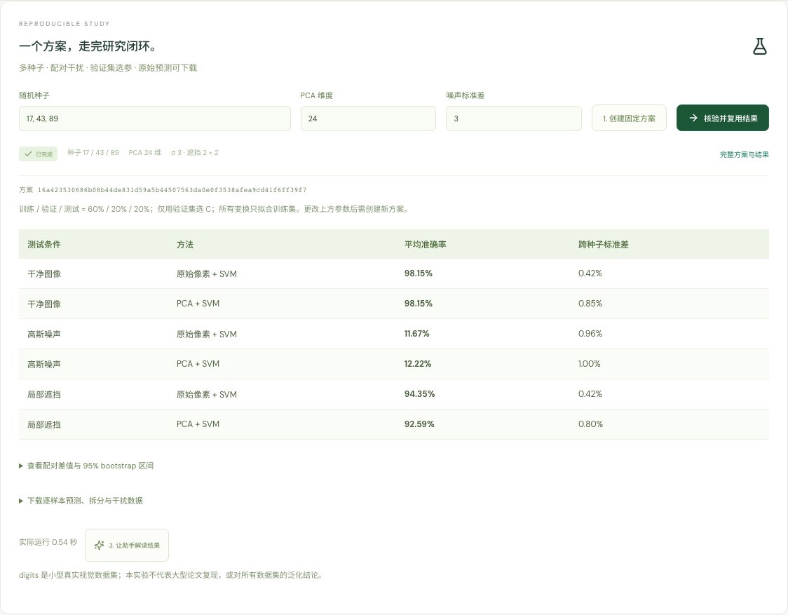

# Vision Scholar · 视觉研究工作台

[](https://github.com/cht21-c/vision-scholar/actions/workflows/ci.yml)
[](https://github.com/cht21-c/vision-scholar/releases/latest)
[](LICENSE)

一个能串起**论文检索、源码定位、研究方案、真实 CPU 实验与证据回查**的 Agent 项目。React / TypeScript 前端，FastAPI 后端，LangGraph 做角色分流，V3 独立实现内层模型与工具执行循环。

[原创贡献](CONTRIBUTIONS.md) · [完整实验报告](docs/research-evaluation.md) · [中文 Excel](evidence/v3/原创机制与实验证据.xlsx) · [完整 Prompt](docs/research-prompts.md) · [演示步骤](docs/demo.md)



## 原创工程做了什么

1. **独立 ResearchEngine**：不继承、不调用 OpenHarness 的 QueryEngine 执行循环；复用其消息 DTO、客户端和工具接口，并明确归属。
2. **预算上下文**：本地完整历史不丢弃，模型请求按完整用户轮选取，保护用户修正原句；只有超预算才将大工具结果转成可重读工件，逐轮记录保留理由与 SHA。
3. **读并行、写屏障**：连续只读工具限流并行，写操作前后形成屏障，保证后面的读看到前面的写；每次调用记录真实 call ID 和执行时间。
4. **可复验研究闭环**：方案参数与代码/数据指纹固定，真实子进程训练，多 seed 配对比较，保留逐样本预测、拆分与干扰数据；重复方案复用结果。

这是独立完成的工程设计与实现，不宣称算法首创。SVM、PCA、bootstrap 等采用标准算法。V0/V1/V2 保留作对照，[贡献矩阵](CONTRIBUTIONS.md)明确区分本项目与开源复用部分。

## 实测结果

冻结后运行128次真实模型留出试验，另保留36次开发试验：

| 任务 | V2 | V3完整历史 | V3预算 |
|---|---:|---:|---:|
| 合成上下文随机标识命中 | 32/32 | 32/32 | 32/32 |
| 平均总Token | 7,427 | 25,705 | 6,577 |
| 正常任务严格工程判据 | 14/16 | — | 14/16 |

- V3预算版相对同引擎完整历史的平均总Token降低 **74.4%**；相对V2降低 **11.4%**。包含错误恢复和重读成本，只适用于这组自建合成上下文任务，不能宣称所有请求都省74.4%。
- 正常任务没有成功率提升证据。各有两次完成了研究但未附完整方案哈希；冻结grader要求该字段，而对应题目未明确要求。原分与这一限制同时公开。
- 调度回放：串行40/40、直接并行35/40、读并行写屏障40/40。人工延迟只能验证机制与这组受控性能。
- 真实digits实验中，两种方法clean均值均为98.15%，但噪声准确率接近随机。PCA遮挡均值更差，负结果保留。
- 84项Python工程测试、桌面/手机2项新增研究流程验收通过；18组研究指标和置信区间已独立重算。

工程判据不等同问答准确率。AI语义复核发现了异常引用文本、区间方向误述等问题；引用来源存在也不意味着事实正确。见[完整报告与局限](docs/research-evaluation.md)。

## 安装与演示

需要 Git、Python 3.11+、uv、Node 20.19+或22.12+。本地验证环境为macOS、Python3.12、Node24。

```bash
./setup.sh
./start.sh
```

打开 http://127.0.0.1:8765 。依赖锁定到固定OpenHarness Git提交，无需相邻仓库。首次安装需要网络，npm锁文件使用公开npmmirror源。

在论文库导入经典四篇；在实验室创建默认方案、执行并下载证据。真实模型需把`.env.example`复制为`.env`，填写自己的`VS_PROVIDER`、`VS_MODEL`、`VS_BASE_URL`、`VS_API_KEY`后重启。没有API时仍可使用检索和实验；mock会明确标为脚本演示。

```bash
# 无模型调用：验证公开结果、重新训练、工程测试
uv run python -m scripts.verify_study evidence/study
uv run python -m scripts.reproduce_study
uv run --extra dev pytest -q

# 完整报告、图表和Excel重建（使用公开证据）
uv sync --locked --extra dev --extra benchmark
uv run --extra benchmark python -m scripts.report_research
```

真实模型复验与全部配置见[复现说明](docs/reproduction.md)。公开结果、完整Prompt和工具Schema都在仓库中；私钥、数据库、个人简历、PDF和下载的模型权重不发布。

## 使用边界

本地单用户、单worker应用，不提供公网鉴权、多人权限或GPU训练平台。源码分析仅开放`examples/`，不等同任意代码仓库Agent。PDF仅支持文字型，不含OCR。

预算是canonical DTO JSON字符上限，不是真实token上限；必要内容过大明确失败。只读声明由工具作者保证；任意线程工具不承诺exactly-once。研究子进程支持终止，不实现断点续训。digits是小型真实研究，不是大型CV论文复现。

项目代码MIT；[HKUDS/OpenHarness](https://github.com/HKUDS/OpenHarness)按MIT归属保留。[第三方声明](THIRD_PARTY_NOTICES.md)说明论文与数据来源。
