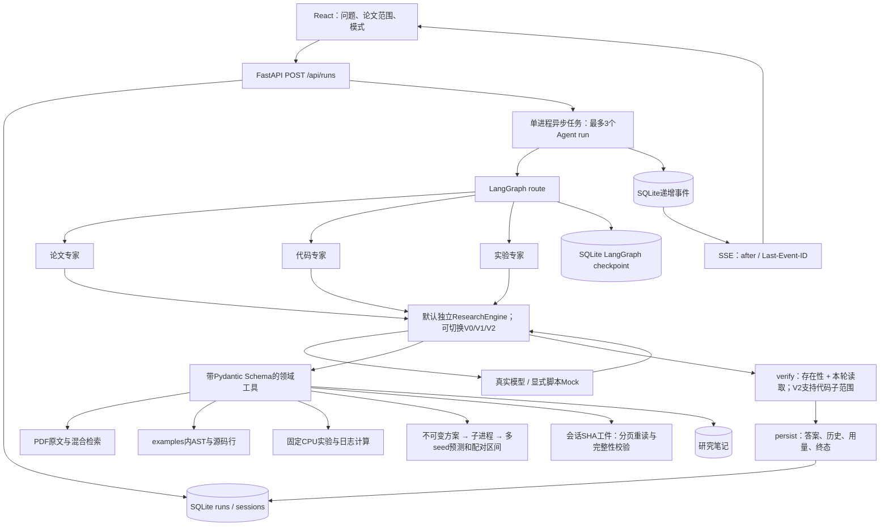

# Vision Scholar：从输入到证据与结果

本页描述当前四个可切换实现。V3为默认独立循环，见[原创贡献](../CONTRIBUTIONS.md)与[冻结留出实验](research-evaluation.md)。V0/V1/V2历史结果见[三版对比](harness-comparison.md)。

## 结构

三个专家使用不同允许工具集合和角色提示。每个请求路由到其中一个专家，之后统一核验、保存；没有虚构并行辩论、群体共识或动态生成 Agent。自动路由是可解释的关键词规则，可在 UI 显式指定模式。

V0独立实现`model↔tools`状态图、串行工具节点和逐节点SQLite checkpoint。V1调用上游QueryEngine。V2在同一循环外保留用户决策原句、来源SHA和时序，持久化到session独立字段；32条/12,000字符的上限与关键词抽取意味着它不是无损通用记忆。Streamlit固定V0；React支持四版。会话绑定harness/retriever，切换组合需要新会话。

V3独立实现模型/工具循环，不调用V0/V1/V2内层执行逻辑。预算视图先测完整请求；放不下时才外置大结果，按完整用户轮选取相关/近期历史，保留当前轮和决策账本。请求视图包含字符预算、被保留轮次、工件hash等解释信息。调度器按声明顺序执行，连续只读工具限流并行，写操作前后等待；事件包含call ID与真实时间。`research_full`保留完整历史，作为相同引擎的上下文消融开关。

## 输入、中间处理与产物

| 输入 | 处理 | 可检查的最终产物 |
|---|---|---|
| arXiv ID / PDF | 固定 HTTPS 域名下载、逐跳检查、体积与格式限制、SHA256 去重、pypdf 提取 | `papers` 元信息、原始 SHA 命名 PDF、`pages`、`chunks` |
| 论文问题 + 范围 | 模型改写英文检索词→BM25/LSA→融合/词项重排→按需读页→生成引用 | 回答、`[paper:pN:cN]`、原文片段、工具 trace |
| 源码问题 | 只读取 `examples/`、AST 定位函数/类、返回真实行区间 | `[code:examples/vision_ops.py:Lx-Ly]`、源码文本 |
| 明确实验请求 + 参数 | Schema 校验→注册函数→真实数据拆分、训练、验证选参、测试计算 | 实验 ID、配置、accuracy/F1/混淆矩阵、拆分与代码 hash |
| 多seed研究参数 | 固定计划SHA→数据库抢占→可终止子进程→配对评估→结果复用 | plan/result、逐样本预测、拆分、干扰数据、bootstrap区间及UI下载 |
| 超预算的历史工具结果 | 会话范围SHA工件→有界预览→按需分页/按词重读 | 未改动的原始工件、请求视图取舍、读取trace |
| JSON/CSV 日志 / 实验 ID | 校验有限数值、epoch 严格递增→Python 计算→规则诊断 | 最佳 epoch、gap、loss 变化、输入 hash |
| 明确保存研究决策 | `save_note` / UI 保存→SQLite | 可回读笔记、会话 Markdown 导出 |
| 评测脚本 | 固定问题→真实 HTTP 执行→预设断言→逐题保存 | 独立 real / mock / retrieval / engineering JSON |

## OpenHarness 的边界

V1/V2直接复用 `QueryEngine`、`ConversationMessage`、流式事件、`ToolRegistry`、`BaseTool`、`ToolResult`、`PermissionChecker`。实际过程为 `模型决定工具 → OpenHarness 解析并校验 Schema/权限 → 本项目工具计算 → 工具结果回到模型 → 最终回答`。同批多工具使用gather并行，读写属性用于权限，并没有保证写工具串行。V0共享DTO和Schema但独立实现循环。OpenAI传输通过共有ObservedClient记录全部请求和重试，Anthropic入口仍复用上游客户端。

本项目实现论文索引、工具参数与结果协议、任务状态、Web 会话、SSE、领域证据门禁、实验/评测和完整 UI；V3新增独立循环、预算上下文、调度器与研究闭环。V1/V2的上游循环、压缩、插件机制或CLI界面不计为原创。详细上游目录解释见 [openharness-analysis.md](openharness-analysis.md)。

## 检索与引用

每页按 200 个空白分词单元切片、步长 160，跨页不混合；ID 固定绑定 paper/page/chunk。章节名通过正则粗略识别，页码采用 PDF 物理页；排版复杂的公式与章节仍应看原 PDF。

默认轻量索引采用 BM25 + TF-IDF/SVD LSA（最多 96 维），分别排序后使用 RRF `1/(60+rank)` 融合，再加入词项覆盖分；同页最多返回两个片段，避免相似内容挤满结果。索引依论文 ID/SHA 缓存，导入后失效，下次检索重建。此路径不依赖神经embedding或向量数据库。

可选`neural`路径真实使用BGE-small-en-v1.5、384维Qdrant local向量召回、BM25、RRF与MiniLM cross-encoder。权重和索引缓存在`data/neural`，加载/索引构建在首次使用时发生。英文模型会按tokenizer上限截断；当前8个限定论文问题未测得命中收益，因此默认仍为轻量检索。

工具将本轮实际检索/读取的片段写入 evidence 集合。回答生成后，门禁逐一核验：

1. 论文引用能否在真实 `chunks` 表中找到；V0/V1代码引用是否是工具返回的行区间，V2还允许父区间内每行齐全的子范围和单行引用，并保留父证据ID。
2. 该片段是否在当前 run 的 evidence 集合中。
3. 只要出现非法引用，run 失败，不发布最终回答和历史；流式草稿明确标为尚未核验。

该门禁没有判断“片段是否支持具体结论”，也不保证无引用的回答可靠。真实模型回归另测检索行为和需要的论文覆盖；语义评审是单独的检查层。没有编造“引用通过率等于事实准确率”。

## 持久化与恢复

- `scholar.db` 使用 WAL；papers/pages/chunks、sessions、runs、events、notes、experiments 分表。
- 创建 run 先落库；partial unique index 约束每个 session 最多一个 queued/running 请求，冲突返回 409。
- Agent 以独立 asyncio task 执行，浏览器断开不会取消后台任务。全局最多 3 个 Agent run，单请求默认 180 秒和 10 个模型轮次。
- 事件先落 SQLite，再由 SSE 读取；`seq` 全局递增，`after` / `Last-Event-ID` 断点续取；前端按 seq 去重并在终态读取最终 run。
- 每个 run 独立 LangGraph `thread_id`；checkpoint 留存节点状态。跨轮对话依 session 中经过清理的 OpenHarness 消息恢复；成功后更新历史，失败/取消保留上次成功历史。
- 重启把 queued/running 标为 interrupted，并补终态事件。已经完成的会话、笔记和实验可继续使用；当前没有自动恢复到半个工具调用处。
- V2笔记采用run ID、工具名和精确参数构造唯一键，数据库唯一约束防止同run重复/并发写两条；新用户run仍允许再次保存。该机制没有扩展到全部副作用。
- 取消生成会终结 Agent run；`asyncio.to_thread` 内已启动的固定 CPU 计算不会被强制杀死，可能继续完成记录。下载/保存等已执行副作用也不会自动回滚。
- V3研究使用独立可终止子进程；同一数据库通过唯一running索引抢占，异常/重启后状态明确。完成方案校验指纹与工件后复用。没有实现进程崩溃后的断点续训。

这不是分布式队列/事务 Outbox：run、history、事件的写入并非一个全局原子事务；服务启动只有一个 worker，重启时做状态修复。若扩成多人平台，需外部队列、worker 所有权/租约、事件与业务状态原子提交、鉴权和资源配额。

## 工具边界

| 工具 | 专家可用 | 核心约束 |
|---|---|---|
| `search_papers` / `read_paper` | 全部 | 当前论文范围、limit/page、只读 |
| `search_arxiv` / `import_arxiv` | 论文 | 固定域名；导入需要当前请求明确授权 |
| `inspect_code` | 代码、实验 | `examples/` 内 Python、100KB、真实 AST 符号 |
| `run_experiment` | 实验 | 预注册函数、Schema、每轮最多2次、明确实验请求 |
| `analyze_log` | 实验 | 最多2MB、2–10000轮、有限数值、字段完整 |
| `save_note` / `list_notes` | 全部 | 写入需要当前请求明确授权；读取本机最近100条 |
| `plan_study` / `run_study` / `read_study` | 实验 | 固定参数/指纹、同run短引用精确映射、只创建题禁止执行 |
| `read_artifact` | 已注册角色 | 当前会话工件、SHA校验、limit/offset/query |

允许集合由注册表和 OpenHarness PermissionChecker 同时限制。没有注册 shell、任意文件写入或模型生成代码执行。论文/日志在 Prompt 中被当作数据；这不等价于已经解决所有提示注入问题。

## 实验口径

digits 是 scikit-learn 内置真实 1797 个 8×8 图像样本。seed=42 分层拆分 train=1077、validation=360、test=360。每种预设方案在训练集拟合 scaler / PCA / SVC，validation 从 C={0.5,2,8} 选择最佳模型，随后独立 test 各评一次。两方案都报结果，不根据测试集改参。

SGDClassifier 单独训练16轮生成真实学习曲线；图表和日志分析展示的是 SGD，而非 SVM 的迭代日志。attention 实验只用随机矩阵展示 patch 变换及 softmax 归一化，无训练、无 CLS token，也不代表图像识别性能。

所有数值由 Python 计算；实验保存数据与划分 SHA、代码 SHA、库版本、配置和耗时。对比结果仅说明本次条件下的观测，不能外推论文性能。
