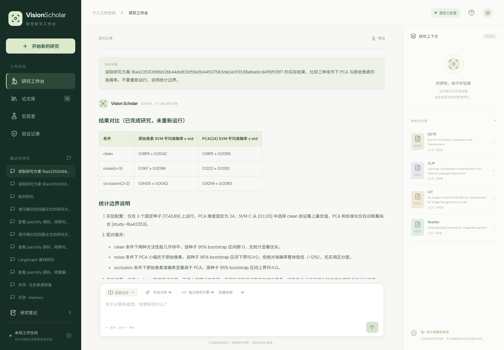

# Five-minute practical demonstration

Run the local app at `http://127.0.0.1:8765`. Configure your own model before the assistant steps. The screenshots and exported answers below come from real UI runs, not mock responses.

## 1. Fix a reproducible research plan

Open **实验室**. Keep seeds `17, 43, 89`, PCA dimension `24` and noise sigma `3`; click **创建固定方案**. Inspect the plan ID and the train/validation/test rule. Changing an input requires a new plan.

Click **执行方案**. The real worker trains two methods, selects C only on the clean validation set, and evaluates the same paired test inputs under clean/noise/occlusion conditions. Repeating the identical plan uses **核验并复用结果** instead of retraining.


Explain the negative result: both methods perform well on clean digits, but fail under the chosen noise condition. PCA is not uniformly better. This makes the demonstration a real experiment with a testable hypothesis, not a favorable-score showcase.

## 2. Trace numbers to predictions

Expand the paired intervals and evidence downloads. Download `predictions-17.json`. The completed desktop and mobile tests checked that its actual download bytes matched the result's SHA256.

Independently verify all 18 metric rows and intervals:

```bash
uv run python -m scripts.verify_study evidence/study
```

Different seeds have overlapping test samples. Intervals are conditional on a fixed split and trained models, not a proof of generalization to other datasets.

## 3. Ask the real agent to interpret the completed run

Click **让助手解读结果** and send the prepared prompt. Select **V3 · 独立研究引擎**. The tested task reads the existing plan through `read_study`, without invoking `run_study`.

The assistant should compare the three conditions and state statistical limitations. The numeric table in the experiment view is the authoritative Python-produced result. Review model prose against it; other benchmark runs include an erroneous interval claim.



This desktop answer contains two statistical prose errors: it says all noise interval lower bounds are positive (they are 0), and all occlusion upper bounds are nonpositive (seed 43 is positive). The screenshot is preserved as observed. The initial native-browser answer and the later mobile answer are also retained. The UI tests verify actions, numeric rows and exports; they do not establish correctness of model-generated prose.

[Desktop answer and run ID](../evidence/demo/desktop-answer.md) · [Mobile answer](../evidence/demo/mobile-answer.md) · [Download/tool verification](../evidence/demo/desktop-verification.json)

## 4. Connect a paper to source evidence

Import the four paper presets, start a new research session and ask:

```text
ViT 如何将图像切成 patch？给出论文页码，并明确区分 patch 数与含分类 token 的序列长度。
```

Click an inline citation to inspect the actual excerpt, full page and original PDF. Then ask:

```text
查看 patchify 源码，解释 reshape 与 transpose 的作用，并引用真实代码行。
```

This demonstrates source access and reference provenance. It does not prove the model's paraphrase is correct. The public semantic audit includes quotation corruption to make this boundary explicit.

## 5. Show the engineering evidence

Open [results](research-evaluation.md) and [contributions](../CONTRIBUTIONS.md). Explain the progression:

1. Reconstructed V0 baseline exposed the need to separate routing and execution.
2. OpenHarness integration provided a reusable loop, but compression and side-effect ordering needed domain-specific treatment.
3. V3 independently implemented the bounded request view and write barriers, then evaluated each with a controlled ablation.

Use the exact claim: “On 32 trials per arm from a fixed synthetic context protocol, the budgeted loop used 74.4% fewer total provider tokens than its full-history ablation, with 32/32 marker checks in both. No normal-task success gain was demonstrated.”

The first interactive browser session created and executed the default study. Subsequent desktop/mobile automation tested reuse of that same plan, verified numeric rows/downloads, and made new real model requests. Screenshots show those subsequent runs; no fabricated video or success state is used.
