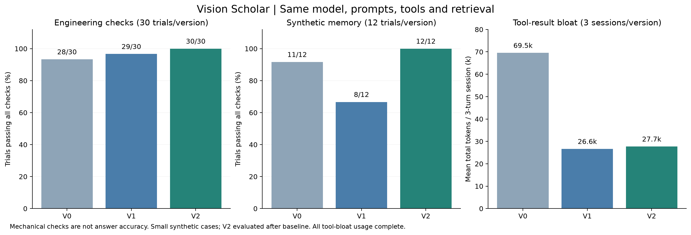
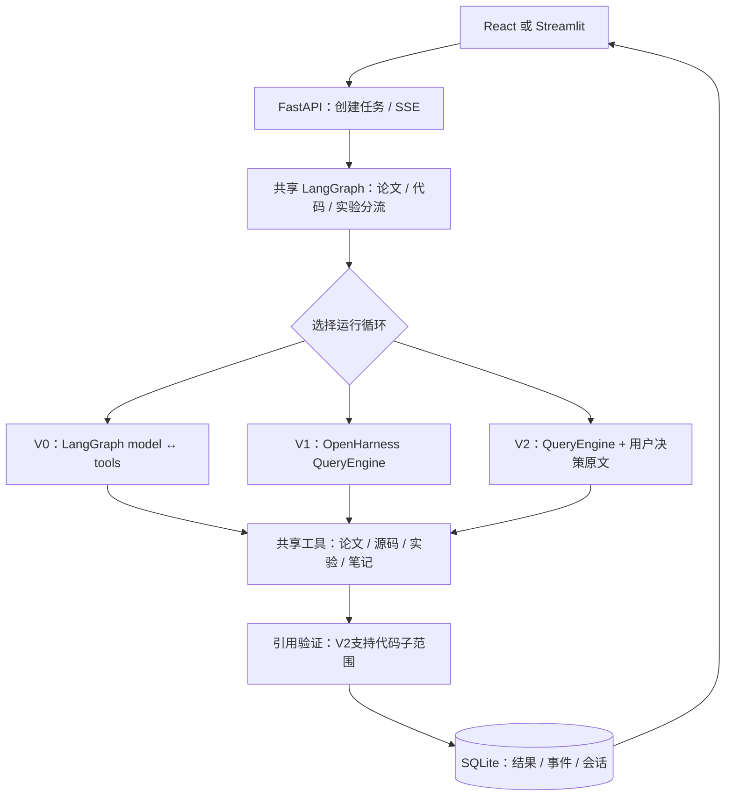

# 从 LangGraph 基线到研究型 Harness：实现、实测与取舍

这是V3开发之前的历史报告；“本轮”指当时的V0/V1/V2比较。当前独立引擎、严格留出集和研究闭环见[V3报告](research-evaluation.md)。两个协议的分数不可混为一次实验。

本轮完成了三套可运行版本、90次正常任务、36次合成上下文会话、9次连通小样、48条独立检索测量、故障注入与浏览器验收。最值得讲的迭代是：**先把工具跑通，再控制上下文成本，最后保护用户决策和证据的完整性。**

实测不支持“换框架让模型全面变聪明”：短任务速度接近，神经检索没有在当前小语料上提高命中；OpenHarness压缩节省了重复工具内容，却可能丢失用户修正。V2针对这个失败保留用户决策原文，并修复代码引用门禁。

本报告中的V0是**本轮按原简历设计重建**的版本。未取得过去的源码，不能把它说成找回历史代码，也不能替你证明过去的研发时间。V1是上一轮接入OpenHarness的版本，V2是本轮基于失败证据的应用层升级。

- 历史Excel可在本地`data/comparison/`查看；最新公开Excel见[V3证据表](../evidence/v3/原创机制与实验证据.xlsx)。
- [机器可读汇总](../evidence/v2/comparison-summary.json) · [历史逐题trace](../evidence/v2/trials/)
- [实验前协议与判据修订](benchmark-protocol.md)
- [完整Prompt、工具Schema与测试输入](comparison-prompts.md)
- [工程贡献与归属](../CONTRIBUTIONS.md)



## 1. 这个助手究竟怎样工作

以“ViT如何把图像变成token”为例：

| 输入 | 中间处理 | 可核查的产物 |
|---|---|---|
| 你的问题、论文范围、运行版本 | FastAPI先创建SQLite任务，LangGraph路由到论文角色 | run ID、会话和任务状态 |
| 中文问题与工具Schema | 模型选择`search_papers`，把检索意图写成英文关键词 | 模型实际返回的工具名和参数 |
| 查询词与论文索引 | BM25与稠密检索融合，必要时`read_paper`读页 | 带物理页码、片段ID的原文 |
| 工具结果与当前历史 | 模型判断继续查资料还是生成回答 | 工具循环、多轮消息、候选回答 |
| 候选回答中的引用 | 服务端检查引用存在、本轮读取；V2额外验证代码子范围 | 有效/无效引用、父证据ID |
| 已验证答案与事件 | 保存历史、用量和终态，SSE把事件推送给前端 | 可点击引用、执行记录、可恢复会话 |

论文检索、读源码、训练和日志统计都是真实代码。模型决定下一步调用哪个工具，再根据结果组织回答。digits训练、准确率和日志指标由Python计算，不由模型猜测。CPU实验是小型真实教学基线，不是复现ViT/ResNet大规模训练。



这里的三个角色是按任务选择不同Prompt和工具集合，并非三个Agent并行讨论。外层业务状态图与内层模型工具循环是两个层次。

## 2. 三个版本实际差在哪里

| 维度 | V0：原设计重建 | V1：OpenHarness接入 | V2：本轮应用升级 |
|---|---|---|---|
| 内层运行循环 | 独立`StateGraph`，model↔tools | 上游`QueryEngine` | 包装同一`QueryEngine` |
| 工具执行 | 本基线串行节点 | 同一批多工具并行，包含获准的写工具 | 同V1 |
| 上下文 | 默认完整历史；实现了可选按用户轮滑窗，但未计入主实验 | microcompact、context collapse、session memory、LLM summary | 同V1，并独立保存用户决策原话 |
| 节点状态 | model/tools节点SQLite checkpoint | 共有外层图checkpoint；内层依QueryEngine消息 | 同V1，增加session决策账本 |
| 代码引用 | 要求精确匹配工具返回的完整区间 | 同V0 | 允许已读取父区间中的完整子范围及单行 |
| 重复保存笔记 | 循环本身不去重 | 循环本身不去重 | 按run ID、工具名、精确参数生成唯一键 |
| 检索 | 可选LSA或真实Qdrant神经混合检索 | 两种均可选 | 两种均可选 |
| 界面 | 原风格Streamlit入口；也支持统一React | React | React |
| 恢复 | checkpoint与成功历史保留 | 成功历史保留，重启标记中断 | 同V1，额外持久化决策原文 |

LangGraph本身可以并发，串行是这份基线的实现选择。Qdrant、前端、SSE、领域工具、引用校验和传输重试也不是某个harness天然独占的能力。

代码入口：

- `backend/legacy_agent.py`：真正独立的LangGraph工具循环；没有调用QueryEngine。只共享消息/事件DTO、工具Schema和传输协议。
- `backend/harnesses.py`：显式选择三种循环。
- `backend/upgrades.py`：决策原文与代码引用扩展，不修改上游。
- `backend/observed_client.py`：记录每次真实模型请求，包括隐藏压缩请求和失败尝试。
- `backend/neural_retrieval.py`：Qdrant local + BGE-small-en-v1.5 + BM25 + RRF + MiniLM cross-encoder。
- `streamlit_app.py`：固定V0，默认神经检索，通过HTTP复用后端。

上游固定commit为`9b2efd795c6aa09f88b0c257d269a9e518da6ae7`。本项目不是“完全自研harness”，是重建基线、集成开源运行循环，并实现领域层升级。

## 3. 怎样保证比较有意义

主实验统一使用实际响应模型`doubao-seed-2-0-lite-260428`，`temperature=0`，关闭thinking。相同Prompt、工具Schema/handler、4篇论文、108页/442片段、预热LSA检索、4500输出token、最多8次模型轮次、180秒用户轮超时。每条任务使用独立数据库与笔记目录。

V0/V1按题目和重复序号轮换执行顺序；V2在观察基线失败后单独批次运行。模型/网络负载并未完全随机化，因此几百毫秒差别不能作为框架因果结论。V0的内层checkpoint写入也属于本实现的一部分，并未从计时中剔除。

10个正常任务分别是ResNet、ViT、CLIP、DETR、跨论文比较、未知信息拒答、源码定位、真实digits、用户合成日志、保存/回读决策，每题3次；记忆任务含2个用户轮。**30次运行是10道固定题的重复，不是30道独立题。**

上下文测试使用4类明确标注为合成的历史，每类3次、每次追问3轮。三个事实使用固定随机标识，防止依赖模型常识猜答案。人为降低压缩阈值以稳定触发分支，并未触及供应商模型的真实最大窗口。

原始回答和失败均保留。digits的9次等价数值误判、拒答语序的1次误判在原回答上校正；未重采样选优，也没有把代码门禁的真实失败改成通过。

## 4. 正常任务：工具都能调用，门禁差异更明显

| 指标 | V0 | V1 | V2 |
|---|---:|---:|---:|
| 原始脚本通过 | 24/30 | 26/30 | 27/30 |
| 仅校正数值格式后 | 27/30 | 29/30 | 30/30 |
| 再校正等价拒答语序后 | **28/30** | **29/30** | **30/30** |
| 必要工具覆盖 | 30/30 | 30/30 | 30/30 |
| 工具参数合法 | 50/50 | 49/49 | 48/48 |
| 成功工具结果 | 50/50 | 49/49 | 48/48 |
| 正常任务自然工具报错 | 0 | 0 | 0 |
| 任务耗时中位数 | 14.32秒 | 13.84秒 | 14.54秒 |
| 任务耗时P95 | 22.92秒 | 22.61秒 | 23.71秒 |
| 用户轮首个可见文本中位数 | 4.70秒 | 4.77秒 | 5.31秒 |
| 输入token总和 | 277,024 | 278,544 | 274,603 |
| 输出token总和 | 15,864 | 15,429 | 15,430 |
| 完整总token | 292,888 | 293,973 | 290,033 |
| API尝试数 | 77 | 78 | 76 |
| 供应商记录的缓存token | 5,544 | 6,112 | 0 |

三版正常任务的消息/工具结果配对均完整；必要工具覆盖代表完成预设操作，不表示每次工具选择都最优。自然调用没有错误，因此无法从这一组估计谁更擅长“模型自主修错”；故障测试单独看。

V2的正常任务提升来自代码引用门禁，不足以证明模型推理能力提升。速度没有明确改善；缓存受批次顺序、前缀和供应商策略影响，不能据此宣称V2缓存机制退化或V1有普适缓存收益。

## 5. 上下文：少花token与不丢决策要同时检查

每个“通过”要求同一会话三个用户轮的dataset、pilot、artifact全部逐字正确。

| 合成情景 | V0 | V1 | V2 | 已确认机制 |
|---|---:|---:|---:|---|
| 短历史 | 2/3 | 2/3 | 3/3 | 未触发压缩；基线各有一次标识输出波动 |
| 冗长工具结果 | 3/3 | 3/3 | 3/3 | V1/V2触发microcompact，清掉旧工具正文 |
| 长消息中的后续修正 | 3/3 | **0/3** | **3/3** | V1/V2均触发session-memory；仅V2独立保留修正原话 |
| 完整摘要压力 | 3/3 | 3/3 | 3/3 | LLM摘要、重试与context collapse；正确但可能很慢 |
| 合计 | **11/12** | **8/12** | **12/12** | 固定压力集，不能泛化成长期记忆准确率 |

每次3轮会话的平均总token：

| 情景 | V0 | V1 | V2 |
|---|---:|---:|---:|
| 短历史 | 4,574 | 4,565 | 5,658 |
| 冗长工具结果 | **69,528** | **26,628** | **27,711** |
| 埋藏修正 | 56,062 | 20,172 | 21,239 |
| 完整摘要压力 | 12,244 | 总量未知；已观测均值13,174 | 总量未知；已观测均值13,079 |

冗长工具结果组用量完整，V2相对V0减少约**60.1%**，同时保持3/3通过；V2比V1多约4.1%，是保护决策原文的开销。在短历史组也可看到额外token成本。不能把四组不完整用量直接相加后计算总节省率。

### 修正为什么会丢

`OpenHarness/services/compact::_summarize_message_for_memory`对单条消息只取前160字符。本例把“pilot改用新标识”放在长用户消息的中段，session-memory分支保留了消息开头，却遗漏修正。旧值因此继续影响回答。原始失败包括：

`data/comparison/trials/context-buried_correction-openharness-r1.json`，以及r2/r3。

V2在压缩前，从**用户消息**提取带“决策、修正、不要、必须”等关键词的原句，按时间保存，附来源消息SHA256；模型请求附上这些原句，后出现的明确修正覆盖早期决定。工具结果、assistant文本、生成摘要不进入账本。

账本最多32条、12,000字符，单句最多2,000字符；不使用LLM合并，不能保证所有自然语言的隐含决策都被识别。它保护原始来源，最新值仍由模型根据时间顺序理解，尚不是通用结构化事实数据库。

这一组没有执行任何工具，因此V2其他两个改动——代码门禁和笔记去重——不参与结果。V1/V2在这里的差别就是决策原文保护，可作为针对该机制的消融证据；它仍是用于开发的固定压力集，尚未验证独立留出集。

### 压缩为什么也会更慢

完整摘要组中位任务时间为V0 **7.80秒**、V1 **57.19秒**、V2 **82.61秒**。上游LLM压缩调用有25秒超时与重试，部分结果甚至比压缩前的估计token更多。V2没有解决这项延迟问题。

上下文组共记录V1 46次API尝试，其中5次无usage；V2 48次，其中10次无usage。缺失集中在摘要取消/超时，无法知道是否实际计费。供应商已观测小计分别是193,617和203,060，**完整总用量未知**。

主报告的首文本时间来自用户轮事件，不把后台摘要的第一个token误当成用户已看到回答。压缩估计值与供应商计费token也分别保留。下一步可做摘要预算、收益预估与超时降级，但本次尚未实现，不能写进已完成成果。

## 6. 工具、引用与恢复：升级归因

### 同一答案回放代码门禁

V0三次代码回答中旧门禁通过1次，V1通过2次，V2通过3次。把**同一批9份答案和同一轮读取证据**交给新门禁，全部通过；原先的3次失败都能定位到完整父区间中的合法子范围。

例如工具读到`L7–L15`，回答分别引用`L12–L13`、`L14`、`L15`。新门禁确认路径一致、范围包含、每行齐全，生成子证据并保留`parent_evidence_id`。未读取、反向范围、超出父范围仍会拒绝。

这修复的是应用契约。相同门禁也可以装在V0上；不能声称“OpenHarness更会引用代码”。证据在[引用门禁回放](../evidence/v2/citation-gate-ablation.json)和`tests/test_upgrades.py`。

### 并行与错误

固定三个各200ms的异步只读Mock工具，3次重复的工具区间中位数：

- V0约0.606秒，整个脚本任务约0.613秒。
- V1约0.202秒，整个任务约0.307秒。
- V2约0.202秒，整个任务约0.309秒。

这是调度机制验证，不是真实网络工具或模型任务的3倍加速承诺。领域CPU操作在线程池中执行，并发收益还受CPU/GIL/工具自身锁约束。

上游当前批次调度不根据读写属性构建依赖图，写工具也可能并行；`is_read_only`用于权限判断。相互依赖的“保存后读取”应分模型轮次调用，本轮记忆任务也是先保存、下一用户轮再读取。事件中的多工具完成通知在整批收齐后才发出，因此Excel中的事件区间不等同于每个工具的纯执行耗时；Mock调度测量直接在handler内计时。

| 故障/机制 | 观察 | 归属 |
|---|---|---|
| 非法Schema、未知工具、工具抛异常 | 两版把错误交回脚本模型，后续正确调用能够继续 | 循环协议；脚本预定修正，非自然模型修错成功率 |
| 并行一项失败 | 返回成功项与失败项，不丢tool结果配对 | 执行循环 |
| 429、连接超时 | 有限重试，逐尝试保存usage与错误 | 共有`ObservedClient` |
| 空响应、达到轮数上限 | 明确失败，不伪装完成 | 循环/应用终态 |
| 历史缺失工具结果 | 清理孤立调用后再送给模型 | 共有消息清理 |
| 重复写操作 | V0/V1原始循环会重复执行 | 框架不自动保证幂等 |
| V2重复保存笔记 | 同run、相同精确参数共用唯一键，并发写只产生一条 | 本应用SQLite约束 |
| 取消 | 停止Agent等待，阻止后续模型轮 | 应用任务与协程 |
| 进程重启 | 保留成功历史，把运行中任务标为interrupted | 共有应用恢复 |

笔记去重不覆盖所有副作用，也不跨新的用户run去重。已开始的线程内CPU实验可能继续完成；系统未实现任意工具的exactly-once或崩溃后自动从中断点续跑。

本轮59项工程回归通过，21项故障/升级用例是其中子集；6项浏览器用例通过，桌面1440px与移动390px均有截图。最终用量字段改动另重跑21项相关回归通过，未重新调用模型筛选结果。

## 7. 原简历的神经检索也已重建，但收益单独验证

完整链路：BGE-small-en-v1.5生成384维向量 → Qdrant local召回前24 → BM25前24 → RRF融合候选 → MiniLM cross-encoder重排前24 → 每页最多2片段 → 返回前6。模型权重在本地缓存，索引有语料/模型签名。

| 8个固定英文、限定论文的查询，每个重复3次 | LSA轻量检索 | 神经混合检索 |
|---|---:|---:|
| 页级Hit@6 | 8/8 | 8/8 |
| MRR@6 | 1.0000 | 0.9375 |
| 预热查询耗时中位数 | 0.0057秒 | 0.6486秒 |

48条测量不是48个独立问题；预设相关页不是段落级人评金标，也不是问答准确率。排除了下载、建索引和模型加载。当前数据不支持神经检索更好，因此主对照保持轻量检索，神经方案作为已实现的可选后端。

英文embedding/reranker有分词长度截断，不能据此保证中文检索、复杂公式和跨页内容效果。后续扩大语料、取消已知论文范围、增加中文/模糊意图和人工段落标注，才更能测出语义检索的价值。

## 8. 工程判据、AI复核、真实金标是三件事

正常任务每个版本各取首次重复的10条，共30条；向相同模型匿名提供用户输入、回答、当前轮工具结果，隐藏框架名称和通过标记，按事实支持、任务完成、边界诚实各0–4分复核。30条均被判pass，使用144,428个有完整usage的token。

**这一结果不等于30条全对。**主执行AI定向回查发现，`normal-unknown-legacy-r1`把局部片段中的85.4%扩成“CLIP论文中最高的ImageNet相关准确率”，而引用只支持一种线性分类适配实验；还有将ResNet某处检测片段泛化成“论文仅记录检测结果”的表述。核心拒答结论不受影响，但范围被夸大，匿名AI复核未指出。

因此保留三层证据，互不覆盖：

1. 原始工程断言与修订断言：检查动作、数值、引用存在/读取。
2. 匿名同模型AI语义复核：辅助发现问题，不是独立裁判。
3. [定向证据回查](../evidence/v2/agent-evidence-audit.json)：AI逐条核对可疑表述与原片段，不是人评，也不是随机抽样。

当前**没有人评金标**，不能写“问答准确率100%”。这是项目迭代中很值得展示的认识：评测器本身也有漏检，必须能回到原始证据重新判断。

## 9. 本次做了什么，下一步还应该做什么

| 实测发现 | 本次已实施 | 尚未实施的下一步 |
|---|---|---|
| 长工具结果浪费输入 | 复用OpenHarness microcompact | 按工具结果用途、时效和来源制定保留预算 |
| 低成本压缩遗漏修正 | 独立用户原话账本、来源SHA、时序与持久化 | 显式决策编辑界面、结构化版本冲突、独立留出测试 |
| 正确细粒度引用被挡 | 本轮父证据范围内派生子引用 | 声明级证据对齐与独立语义标注 |
| 同一笔记可能重复写入 | run内精确参数唯一键 | 对其他副作用设计各自幂等键与外部结果查验 |
| 摘要慢且用量可能漏计 | 逐API尝试观测，未知用量与已观测小计分离 | 摘要预算、收益预估、避免收益为负的压缩 |
| 神经检索更重却无收益 | 保留可切换实现，单独报告结果 | 扩大语料和查询类型，评估后决定默认方案 |

## 10. 运行与复验

已运行的React入口：<http://127.0.0.1:8765>。Streamlit基线入口：<http://127.0.0.1:8501>。

React输入框选择V0/V1/V2和检索器，切换组合时新建研究会话；已有会话固定运行版本与检索器，避免将压缩后的历史当作完整基线历史。Streamlit固定V0，默认neural。

若服务已停止，在不同终端启动：

```bash
cd vision-scholar
# 使用本轮本地保存的授权凭据；不在命令行打印密钥
.venv/bin/python -m scripts.serve_comparison
```

```bash
cd vision-scholar
.venv/bin/streamlit run streamlit_app.py --server.address 127.0.0.1 --server.port 8501
```

不要再开一个FastAPI worker共用本数据目录。普通`.env`配置仍可通过`./start.sh`启动。全新安装后补齐比较用依赖：

```bash
uv sync --locked --extra dev --extra benchmark
```

已存在的逐题文件会直接复用，包括失败项；复验新一批应先归档整个`data/comparison`，不要仅删除失败项。

```bash
# 主对照；会调用真实模型
.venv/bin/python -m scripts.compare_harnesses --suite normal --repetitions 3
.venv/bin/python -m scripts.compare_harnesses --suite normal --repetitions 3 --harnesses upgraded
.venv/bin/python -m scripts.compare_harnesses --suite context --repetitions 3
.venv/bin/python -m scripts.compare_harnesses --suite context --repetitions 3 --harnesses upgraded

# 检索独立测量；不调用远端LLM
.venv/bin/python -m scripts.compare_retrieval

# 工程回归与故障调度；不调用远端LLM
.venv/bin/pytest -q --junitxml=data/comparison/regression.xml
.venv/bin/python -m scripts.compare_faults

# 匿名AI复核会调用模型；汇总脚本只读已有结果
.venv/bin/python -m scripts.review_comparison
.venv/bin/python -m scripts.report_comparison
```

`trials/`保存完整请求、回答、工具事件和原始usage，Excel每行链接回原文件。`comparison-summary.json`重算用量与判据；原来的`normal-summary.json`等保留最初口径。完整Prompt和Schema另见[可复验输入](comparison-prompts.md)。

本次设计、实验和实现均在2026-10-03这轮工作中完成；简历日期仍须使用你真实的项目经历。
