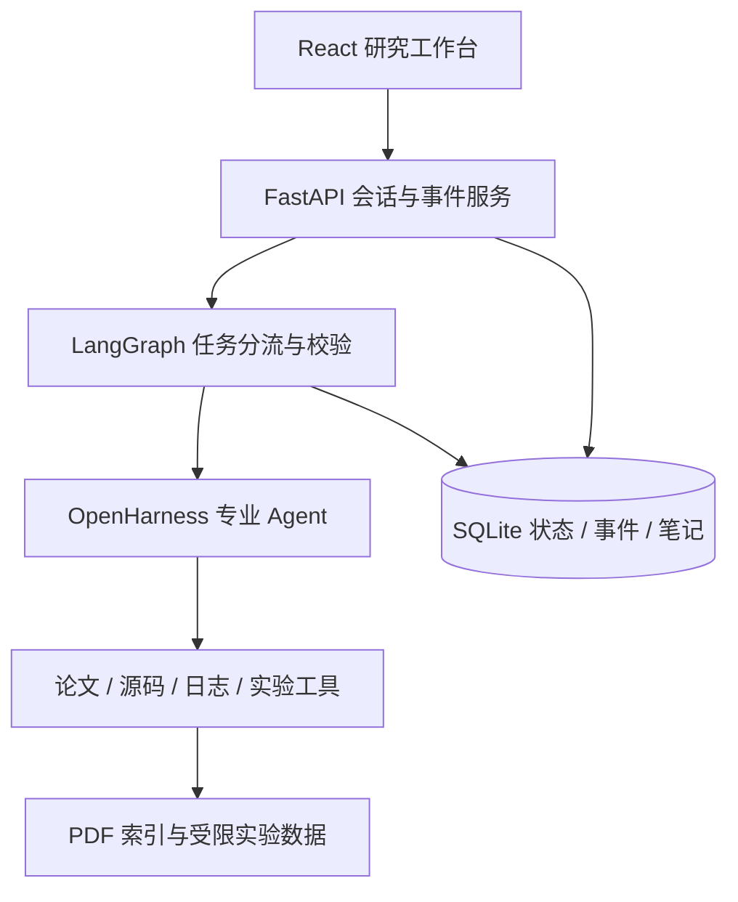

# HKUDS/OpenHarness 结构与采用方式

来源：<https://github.com/HKUDS/OpenHarness>。GitHub 组织信息 `HKUDS` 的名称为 `✨Data Intelligence Lab@HKU✨`。与 `MaxGfeller/open-harness` 的 TypeScript 项目不同。

本次拉取：2026-10-03，commit `9b2efd795c6aa09f88b0c257d269a9e518da6ae7`，包版本 `0.1.9`，MIT 许可。以下根据该 commit 源码分析，不把 README 中历史测试数量当作本次验证。

| 目录/模块 | 负责什么 | 本项目如何采用 |
|---|---|---|
| `src/openharness/engine/query_engine.py` | 拥有历史消息，提交用户输入，管理用量和模型设置 | 每个专业角色创建 QueryEngine，加载持久化历史 |
| `engine/query.py` | 真正的工具调用循环：模型流式输出 → 工具解析 → 权限检查 → 执行 → 回传结果；支持并发工具、上下文压缩、轮数上限 | 直接复用，不另写假 Agent 循环 |
| `engine/messages.py` / `stream_events.py` | 标准消息、工具调用/结果类型、增量事件 | 转为应用的 SQLite 事件流和 SSE；保留可恢复消息 |
| `api/` | Anthropic、OpenAI 兼容协议、Codex/Copilot 等 provider，重试、错误与 token 用量 | 采用 API 兼容客户端；显式配置真实或 mock provider |
| `tools/base.py` | Pydantic 输入 Schema、BaseTool、ToolResult、ToolRegistry | 实现论文、代码、日志、实验等领域工具 |
| `permissions/` | 工具 allow/deny、路径规则、命令规则与模式 | 仅注册和允许领域工具，不暴露任意命令执行 |
| `hooks/` | 工具前后、用户提交和完成时的生命周期处理 | 框架可扩展能力；不将未实际接入的 hook 宣称为自研 |
| `skills/` / `plugins/` / `mcp/` | 按需知识加载、插件工具、MCP 集成 | 保留后续接入空间，本期不为数量堆砌 |
| `services/session_storage.py` / `services/compact/` | 文件会话快照、上下文压缩 | 复用消息协议，Web 会话和事件采用 SQLite 独立持久化 |
| `coordinator/`、任务与团队模块 | 子 Agent 协作、后台任务 | 本项目先采用 LangGraph 路由到专业 Agent，不宣称完整 swarm |
| `frontend/terminal/` | React/Ink 终端界面 | 不是 Web UI，本项目单独实现浏览器工作台 |
| `ohmo/` 与 `channels/` | 个人助手、IM channel 和 gateway | 不属于本期研究工作台功能 |

## 为什么能补强简历项目

原项目要回答的核心问题是：模型如何选择工具，工具结果如何回到状态中，失败能否定位，结论能否回到证据。OpenHarness 提供成熟的工具调用协议和运行循环；真正的项目价值应放在 CV 领域数据、可靠的检索与引用、可复现的实验和可观察的端到端流程。

## 已发现的集成注意点

1. 上游默认产品是 CLI，不等同于可直接上线的 Web 后端。Web 的作业生命周期、断线重放、并发限制、上传和访问控制需要独立实现。
2. `ToolRegistry` 就定义在 `tools/base.py` 中，不存在 `tools/registry.py`；应使用实际导出的类。
3. `QueryEngine.submit_message` 在 `AssistantTurnComplete` 时同步历史。取消/失败时，应用需清理未配对工具消息，不能盲目回放损坏的历史。
4. 显式 `allowed_tools` 的判断先于自定义 path rules；不能认为同时配置 allow list 与路径规则就自动隔离任意文件。应用工具本身必须校验可读目录。
5. QueryEngine 使用流式 API 协议，可注入 scripted client 来测试整个真实运行循环；这只验证工程机制，不代表模型能力。
6. 开源依赖范围宽，安装后需要实际 import、工具循环测试和依赖锁定。MIT 许可与上游 commit 应保留在项目文档。
7. 文献检索返回合法页码、引用确实被读取，与引用能否支持回答是两层验证，不能混为一个“准确率”。

当前实现范围与验收见[贡献矩阵](../CONTRIBUTIONS.md)和[V3实测报告](research-evaluation.md)。本页分析的上游commit保持不变；最终组件归属以当前贡献矩阵为准。
