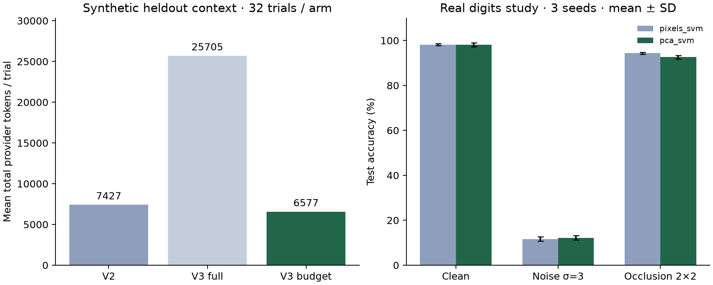

# V3 留出实验与实战报告

V3 的主要可量化收益是上下文用量与工具执行顺序的可解释性。当前结果没有证明正常任务成功率提高。
全部数字由 `python -m scripts.report_research` 从公开 JSON 重建，失败不剔除。

## 冻结与样本

开发36次、留出128次，合计164次真实模型试验。正常任务8题×2版本×2次；合成上下文16会话×3版本×2次。模型为 doubao-seed-2-0-lite-260428，temperature=0、关闭thinking。每个批次并发4；正常任务和上下文批次曾同时运行，跨批次最高并发8。题目为项目自建，两个重复共享题目；不存在人评金标或开放领域泛化准确率。

`benchmarks/v3/protocol.json` 在实现前冻结；完整上下文生成器和后端源码在开发后、留出前冻结。公开 export-manifest 记录原始与脱敏版本 SHA256，并验证冻结源码未变。

## 留出结果

| 任务 | 版本 | 严格通过 | 平均总Token | 平均秒 | API次数 | 工具错误 |
|---|---|---:|---:|---:|---:|---:|
| context | V3 budget | 32/32 | 6,577.0 | 3.41 | 48 | 0 |
| context | V3 full | 32/32 | 25,704.5 | 5.06 | 65 | 33 |
| context | V2 | 32/32 | 7,427.4 | 4.28 | 62 | 30 |
| tasks | V3 budget | 14/16 | 8,759.5 | 12.78 | 41 | 2 |
| tasks | V2 | 14/16 | 9,332.7 | 12.63 | 43 | 3 |

上下文总Token：V3预算版相对同引擎完整历史下降 **74.4%**，相对V2下降 **11.4%**。96次均命中精确随机标识，所有128次留出usage记录完整。

总Token包含错误调用和重读。完整历史组在归档题额外尝试了不存在的工件ID，V2也出现无效工件读取；这些恢复成本放大了总用量差。故74.4%不能表述成所有场景的纯压缩率。summary.json另给首请求输入用量。用户修正子集上V2平均3956.5 token，V3平均4417.1；V3并非所有子场景更省。工具错误不等于API错误，也不一定导致最终失败。

V3预算上限18000指包含系统、Schema与消息的canonical DTO JSON字符数；不是真实token或wire bytes。预算必要内容过大时明确失败。全历史组无预算约束。V3无LLM摘要调用。

## 失败与语义复核

V2/V3各有两次研究任务未在回答附上完整方案哈希，严格结果均14/16。工具执行、六组均值均正确；该题Prompt未明确要求完整ID，而冻结grader要求它。报告保留原分，公开这一评测限制，不改写为16/16。

AI复核还发现：四次ViT答案出现原文没有的异常token；一次V2答案误称遮挡区间上界全部≤0；一次V3拒答虽结论合适，却把DETR移除FFN的消融误称为纯Transformer。引用门禁只证明来源存在且本轮已读取，不证明命题被原文支持。详见 [逐条语义问题](../evidence/v3/semantic-audit.json)，这些结果不是独立人评准确率。

## 调度消融（人工延迟）

| 模式 | 工程判据 | 六次只读调用均秒 |
|---|---:|---:|
| serial | 40/40 | 0.2511 |
| parallel | 35/40 | 0.0835 |
| barrier | 40/40 | 0.0840 |

每模式8种场景×5次，相同调用清单。直接并行在write→read的5次回放中均读到旧值。屏障模式40/40，连续只读仍可并行。延迟由脚本注入，不能当生产性能或任意副作用保证。

## 真实研究

| 条件 | 方法 | 准确率均值 | 跨seed标准差 |
|---|---|---:|---:|
| clean | pixels_svm | 98.15% | 0.42% |
| clean | pca_svm | 98.15% | 0.85% |
| noise | pixels_svm | 11.67% | 0.96% |
| noise | pca_svm | 12.22% | 1.00% |
| occlusion | pixels_svm | 94.35% | 0.42% |
| occlusion | pca_svm | 92.59% | 0.80% |

固定seed17/43/89、60/20/20分割、PCA24、C=0.1/1/10、噪声σ=3、2×2遮挡。变换仅拟合训练集，C仅由clean验证集选择，不重拟合验证集。每seed两个方法共享测试样本和干扰，区间为2000次配对bootstrap。不同seed测试集重叠，不能合并为独立样本；区间条件于固定拆分与训练模型。

两个方法在噪声下均接近随机分类；PCA在遮挡下平均更差。这些负结果保留，不宣称PCA改善整体鲁棒性，也不宣称复现大型CV论文。独立验证脚本已重算18组指标、所有均值/标准差与区间，并核对数据集、拆分、干扰和方案哈希。

## 实战与复验

桌面与手机各完成：固定方案→执行或同方案复用→6行数值匹配→真实下载并校验SHA→V3调用read_study解释→Markdown导出。2项浏览器用例通过，未出现页面JS错误或横向溢出。这两项使用已有默认方案时验证的是复用；首次UI真实执行另由本地记录和独立指标核验支持。

UI通过指动作、数值表、下载与导出通过。桌面模型回答仍把noise区间下界说成全部>0，并把occlusion区间上界说成全部≤0；已在demo与语义审计中标注并保留，未重试筛选截图。




```bash
python -m scripts.verify_study evidence/study
python -m scripts.reproduce_study
python -m scripts.report_research
```

[中文Excel](../evidence/v3/原创机制与实验证据.xlsx) · [逐题请求与结果](../evidence/v3/trials/) · [公开实战记录](../evidence/demo/) · [开发失败](v3-development.md)
